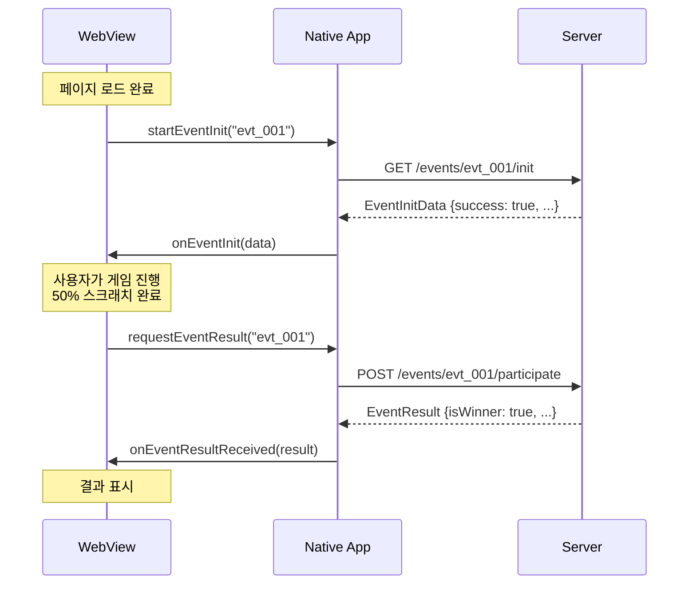
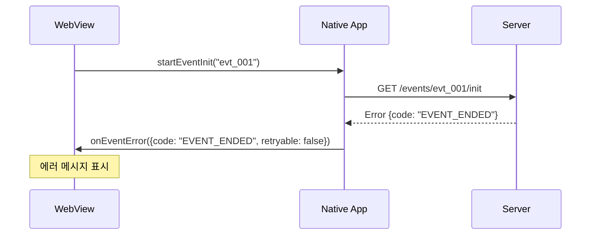
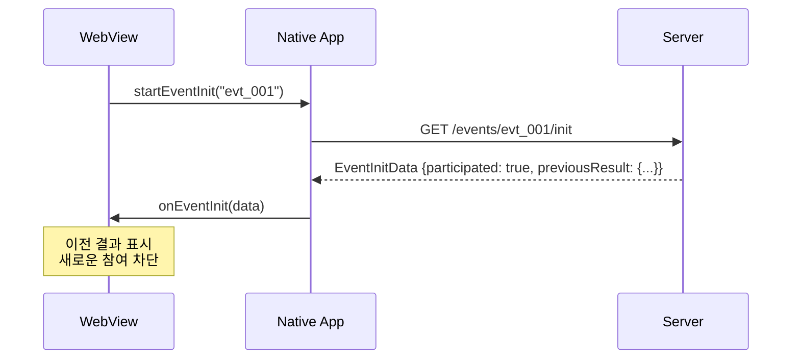

# 앱-웹 브릿지 인터페이스 API 명세

**프로젝트**: 복권 긁기 게임  
**담당자**: 김도현 (프론트엔드)  
**문서 버전**: v1.0  
**작성일**: 2025-09-05

---

## 📋 목차

1. [개요](#개요)
2. [인터페이스 정의](#인터페이스-정의)
3. [통신 플로우](#통신-플로우)
4. [데이터 타입](#데이터-타입)
5. [에러 처리](#에러-처리)
6. [Mock 시스템](#mock-시스템)
7. [구현 가이드](#구현-가이드)
8. [테스트 방법](#테스트-방법)
9. [트러블슈팅](#트러블슈팅)

---

## 개요

### 🎯 목적
모바일 앱(iOS/Android)의 WebView와 복권 긁기 게임 웹페이지 간의 양방향 통신을 위한 브릿지 인터페이스

### 🔗 통신 방식
- **웹 → 앱**: JavaScript 함수 호출
- **앱 → 웹**: 글로벌 콜백 함수 실행

### 📱 지원 플랫폼
- iOS 14+ (WebKit)
- Android 5.0+ (Chrome WebView)

---

## 인터페이스 정의

### 🌉 WebToApp Interface (웹 → 앱 호출)

#### 1. startEventInit(eventId)
이벤트 초기화를 요청합니다.

```javascript
/**
 * 이벤트 초기화 요청
 * @param {string} eventId - 이벤트 고유 식별자
 */
window.Android?.startEventInit(eventId);
// 또는
window.webkit?.messageHandlers.startEventInit?.postMessage({ eventId });
```

**파라미터:**
- `eventId` (string): 이벤트 고유 ID (예: "evt_20250905_001")

**동작:**
1. 사용자 인증 상태 확인
2. 이벤트 참여 자격 검증
3. 이벤트 메타데이터 조회
4. `onEventInit()` 콜백 호출

#### 2. requestEventResult(eventId)  
게임 완료 후 당첨 결과를 요청합니다.

```javascript
/**
 * 당첨 결과 요청 (게임 완료 후)
 * @param {string} eventId - 이벤트 고유 식별자
 */
window.Android?.requestEventResult(eventId);
// 또는
window.webkit?.messageHandlers.requestEventResult?.postMessage({ eventId });
```

**파라미터:**
- `eventId` (string): 이벤트 고유 ID

**동작:**
1. 서버에 참여 기록 전송
2. 당첨 로직 실행
3. 결과 저장
4. `onEventResultReceived()` 콜백 호출

#### 3. sendAnalytics(data)
사용자 행동 분석 데이터를 전송합니다.

```javascript
/**
 * 분석 데이터 전송
 * @param {Object} data - 분석 데이터
 */
window.Android?.sendAnalytics({
  event: 'scratch_progress',
  eventId: 'evt_20250905_001',
  progress: 25,
  timestamp: Date.now()
});
```

**파라미터:**
- `data` (Object): 분석 데이터 객체

---

### 🔄 AppToWeb Interface (앱 → 웹 콜백)

#### 1. onEventInit(data)
이벤트 초기화 완료 콜백

```javascript
/**
 * 이벤트 초기화 완료 콜백
 * @param {EventInitData} data - 초기화 데이터
 */
window.onEventInit = function(data) {
  if (data.success) {
    // 초기화 성공 처리
    gameManager.initialize(data);
  } else {
    // 초기화 실패 처리
    errorHandler.handle(data.error);
  }
};
```

#### 2. onEventResultReceived(result)
당첨 결과 수신 콜백

```javascript
/**
 * 당첨 결과 수신 콜백
 * @param {EventResult} result - 당첨 결과
 */
window.onEventResultReceived = function(result) {
  if (result.success) {
    // 결과 표시
    resultModal.show(result);
  } else {
    // 에러 처리
    errorHandler.handle(result.error);
  }
};
```

#### 3. onEventError(error)
에러 발생 콜백

```javascript
/**
 * 에러 발생 콜백
 * @param {EventError} error - 에러 정보
 */
window.onEventError = function(error) {
  console.error('Bridge Error:', error);
  errorDisplay.show(error.message);
  
  if (error.retryable) {
    // 재시도 가능한 에러
    showRetryButton();
  } else {
    // 치명적 에러
    showFatalErrorMessage();
  }
};
```

---

## 통신 플로우

### 🔄 정상 플로우 (성공적 참여)



### ❌ 에러 플로우



### 🔄 재참여 플로우



---

## 데이터 타입

### 📊 EventInitData
이벤트 초기화 데이터

```typescript
interface EventInitData {
  success: boolean;              // 초기화 성공 여부
  eventId: string;               // 이벤트 ID
  eventName: string;             // 이벤트 명
  eventType: 'scratch' | 'card'; // 게임 타입
  status: 'active' | 'inactive' | 'ended'; // 이벤트 상태
  participated: boolean;         // 기 참여 여부
  participationDate?: string;    // 참여 일시 (ISO 8601)
  previousResult?: EventResult;  // 이전 참여 결과
  metadata?: {                   // 메타데이터
    description?: string;        // 이벤트 설명
    startDate?: string;          // 시작 일시
    endDate?: string;            // 종료 일시
    maxParticipants?: number;    // 최대 참여자 수
    currentParticipants?: number; // 현재 참여자 수
  };
  error?: EventError;            // 에러 정보 (실패시)
}
```

### 🏆 EventResult
당첨 결과 데이터

```typescript
interface EventResult {
  success: boolean;              // 요청 성공 여부
  eventId: string;               // 이벤트 ID
  participationId?: string;      // 참여 ID
  isWinner: boolean;             // 당첨 여부
  rewardId?: string;             // 상품 ID
  rewardName?: string;           // 상품명
  rewardDescription?: string;    // 상품 설명
  rewardImage?: string;          // 상품 이미지 URL
  message: string;               // 사용자 표시 메시지
  participationDate: string;     // 참여 일시 (ISO 8601)
  metadata?: {                   // 추가 메타데이터
    category?: string;           // 상품 카테고리
    value?: number;              // 상품 가치
    expirationDate?: string;     // 유효기간
    redeemCode?: string;         // 교환 코드
  };
  error?: EventError;            // 에러 정보 (실패시)
}
```

### 🚨 EventError
에러 정보

```typescript
interface EventError {
  code: string;                  // 에러 코드
  message: string;               // 사용자 표시 메시지
  details?: string;              // 상세 에러 메시지
  retryable: boolean;            // 재시도 가능 여부
  timestamp: string;             // 에러 발생 시각 (ISO 8601)
  context?: {                    // 에러 컨텍스트
    eventId?: string;
    userId?: string;
    sessionId?: string;
  };
}
```

### 📈 AnalyticsData
분석 데이터

```typescript
interface AnalyticsData {
  event: string;                 // 이벤트명
  eventId: string;               // 이벤트 ID
  timestamp: number;             // 타임스탬프
  data?: Record<string, any>;    // 추가 데이터
}
```

---

## 에러 처리

### 📋 에러 코드 정의

| 코드 | 메시지 | 설명 | 재시도 |
|------|--------|------|--------|
| `EVENT_NOT_FOUND` | "존재하지 않는 이벤트입니다" | 이벤트 ID 없음 | ❌ |
| `EVENT_ENDED` | "종료된 이벤트입니다" | 이벤트 기간 만료 | ❌ |
| `EVENT_INACTIVE` | "진행중이지 않은 이벤트입니다" | 이벤트 비활성화 | ❌ |
| `ALREADY_PARTICIPATED` | "이미 참여하신 이벤트입니다" | 중복 참여 차단 | ❌ |
| `USER_NOT_AUTHENTICATED` | "로그인이 필요합니다" | 인증 실패 | ❌ |
| `QUOTA_EXCEEDED` | "참여 인원이 마감되었습니다" | 수량 제한 도달 | ❌ |
| `NETWORK_ERROR` | "네트워크 연결을 확인해주세요" | 통신 오류 | ✅ |
| `SERVER_ERROR` | "일시적 오류가 발생했습니다" | 서버 오류 | ✅ |
| `BRIDGE_ERROR` | "앱을 다시 실행해주세요" | 브릿지 통신 오류 | ❌ |
| `UNKNOWN_ERROR` | "알 수 없는 오류가 발생했습니다" | 예상치 못한 오류 | ❌ |

### 🔄 에러 처리 패턴

```javascript
class BridgeErrorHandler {
  static handle(error) {
    Logger.error('Bridge Error:', error);
    
    switch(error.code) {
      case 'NETWORK_ERROR':
      case 'SERVER_ERROR':
        return this.handleRetryableError(error);
        
      case 'ALREADY_PARTICIPATED':
        return this.handleParticipatedError(error);
        
      case 'EVENT_ENDED':
      case 'EVENT_INACTIVE':
        return this.handleEventUnavailableError(error);
        
      default:
        return this.handleUnknownError(error);
    }
  }

  static async handleRetryableError(error) {
    const shouldRetry = await this.showRetryDialog(error.message);
    if (shouldRetry) {
      // 재시도 로직
      return this.retry();
    }
  }

  static handleParticipatedError(error) {
    // 이전 결과 표시
    if (error.context?.previousResult) {
      resultModal.show(error.context.previousResult);
    }
  }
}
```

---

## Mock 시스템

### 🧪 개발용 Mock 구현

#### 브릿지 Mock 클래스

```javascript
// src/js/utils/MockBridge.js
class MockBridge {
  constructor() {
    this.scenarios = {
      success: 0.6,           // 60% 정상 시나리오
      alreadyParticipated: 0.2, // 20% 재참여 시나리오
      networkError: 0.1,      // 10% 네트워크 에러
      eventEnded: 0.1         // 10% 이벤트 종료
    };
  }

  // 앱 브릿지 시뮬레이션
  install() {
    if (this.isDevEnvironment()) {
      window.Android = {
        startEventInit: this.mockStartEventInit.bind(this),
        requestEventResult: this.mockRequestEventResult.bind(this),
        sendAnalytics: this.mockSendAnalytics.bind(this)
      };
    }
  }

  mockStartEventInit(eventId) {
    const scenario = this.selectScenario();
    
    setTimeout(() => {
      switch(scenario) {
        case 'success':
          this.mockInitSuccess(eventId);
          break;
        case 'alreadyParticipated':
          this.mockAlreadyParticipated(eventId);
          break;
        case 'networkError':
          this.mockNetworkError();
          break;
        case 'eventEnded':
          this.mockEventEnded();
          break;
      }
    }, this.getRandomDelay(300, 1000));
  }

  mockInitSuccess(eventId) {
    window.onEventInit?.({
      success: true,
      eventId: eventId,
      eventName: "신년 복권 이벤트",
      eventType: "scratch",
      status: "active",
      participated: false,
      metadata: {
        description: "새해를 맞이하여 준비한 특별 이벤트!",
        startDate: "2025-01-01T00:00:00Z",
        endDate: "2025-01-31T23:59:59Z",
        maxParticipants: 10000,
        currentParticipants: 7234
      }
    });
  }

  mockAlreadyParticipated(eventId) {
    window.onEventInit?.({
      success: true,
      eventId: eventId,
      eventName: "신년 복권 이벤트",
      eventType: "scratch",
      status: "active",
      participated: true,
      participationDate: "2025-01-15T10:30:00Z",
      previousResult: {
        success: true,
        eventId: eventId,
        isWinner: Math.random() > 0.7,
        rewardName: "스타벅스 아메리카노",
        message: "이미 참여하신 이벤트입니다.",
        participationDate: "2025-01-15T10:30:00Z"
      }
    });
  }

  mockNetworkError() {
    window.onEventError?.({
      code: "NETWORK_ERROR",
      message: "네트워크 연결을 확인해주세요",
      retryable: true,
      timestamp: new Date().toISOString()
    });
  }

  mockRequestEventResult(eventId) {
    const isWinner = Math.random() > 0.7; // 30% 당첨률
    
    setTimeout(() => {
      window.onEventResultReceived?.({
        success: true,
        eventId: eventId,
        participationId: "part_" + Date.now(),
        isWinner: isWinner,
        rewardId: isWinner ? "rwd_starbucks_americano" : null,
        rewardName: isWinner ? "스타벅스 아메리카노" : null,
        rewardDescription: isWinner ? "매장에서 사용 가능한 아메리카노 쿠폰" : null,
        message: isWinner ? "축하합니다! 당첨되셨습니다!" : "아쉽지만 다음 기회에!",
        participationDate: new Date().toISOString(),
        metadata: isWinner ? {
          category: "beverage",
          value: 4500,
          expirationDate: "2025-02-28T23:59:59Z",
          redeemCode: "STAR" + Math.random().toString(36).substr(2, 8).toUpperCase()
        } : null
      });
    }, this.getRandomDelay(800, 2000));
  }

  mockSendAnalytics(data) {
    console.log('📊 Analytics:', data);
  }

  // 유틸리티 메서드
  selectScenario() {
    const rand = Math.random();
    let cumulative = 0;
    
    for (const [scenario, probability] of Object.entries(this.scenarios)) {
      cumulative += probability;
      if (rand <= cumulative) {
        return scenario;
      }
    }
    
    return 'success';
  }

  getRandomDelay(min, max) {
    return Math.floor(Math.random() * (max - min + 1)) + min;
  }

  isDevEnvironment() {
    return window.location.hostname === 'localhost' || 
           window.location.hostname === '127.0.0.1';
  }
}

// Mock 설치
const mockBridge = new MockBridge();
mockBridge.install();
```

#### 시나리오별 테스트

```javascript
// 특정 시나리오 강제 실행
class MockScenarioRunner {
  static forceSuccess(eventId = "test_event") {
    window.onEventInit?.({
      success: true,
      eventId: eventId,
      eventName: "테스트 이벤트",
      eventType: "scratch",
      status: "active",
      participated: false
    });
  }

  static forceAlreadyParticipated(eventId = "test_event") {
    window.onEventInit?.({
      success: true,
      eventId: eventId,
      participated: true,
      previousResult: {
        success: true,
        isWinner: true,
        rewardName: "테스트 상품",
        message: "이미 참여하셨습니다."
      }
    });
  }

  static forceWin(eventId = "test_event") {
    window.onEventResultReceived?.({
      success: true,
      eventId: eventId,
      isWinner: true,
      rewardName: "당첨 상품",
      message: "축하합니다!",
      participationDate: new Date().toISOString()
    });
  }

  static forceLose(eventId = "test_event") {
    window.onEventResultReceived?.({
      success: true,
      eventId: eventId,
      isWinner: false,
      message: "다음 기회에!",
      participationDate: new Date().toISOString()
    });
  }
}

// 개발자 도구에서 사용
if (window.location.hostname === 'localhost') {
  window.MockScenarioRunner = MockScenarioRunner;
}
```

---

## 구현 가이드

### 🔧 EventBridge 클래스

```javascript
// src/js/core/EventBridge.js
class EventBridge {
  constructor() {
    this.eventId = null;
    this.callbacks = {};
    this.timeout = 10000; // 10초 타임아웃
    
    this.setupCallbacks();
  }

  setupCallbacks() {
    // 글로벌 콜백 함수 등록
    window.onEventInit = this.handleEventInit.bind(this);
    window.onEventResultReceived = this.handleEventResult.bind(this);
    window.onEventError = this.handleEventError.bind(this);
  }

  async initialize(eventId) {
    this.eventId = eventId;
    
    return new Promise((resolve, reject) => {
      // 타임아웃 설정
      const timeoutId = setTimeout(() => {
        reject(new Error('BRIDGE_TIMEOUT'));
      }, this.timeout);

      // 성공/실패 콜백
      this.callbacks.init = {
        resolve: (data) => {
          clearTimeout(timeoutId);
          resolve(data);
        },
        reject: (error) => {
          clearTimeout(timeoutId);
          reject(error);
        }
      };

      // 앱 호출
      this.callNative('startEventInit', eventId);
    });
  }

  async requestResult() {
    if (!this.eventId) {
      throw new Error('Event not initialized');
    }

    return new Promise((resolve, reject) => {
      const timeoutId = setTimeout(() => {
        reject(new Error('BRIDGE_TIMEOUT'));
      }, this.timeout);

      this.callbacks.result = {
        resolve: (data) => {
          clearTimeout(timeoutId);
          resolve(data);
        },
        reject: (error) => {
          clearTimeout(timeoutId);
          reject(error);
        }
      };

      this.callNative('requestEventResult', this.eventId);
    });
  }

  callNative(method, data) {
    try {
      if (window.Android && typeof window.Android[method] === 'function') {
        // Android WebView
        window.Android[method](data);
      } else if (window.webkit?.messageHandlers?.[method]) {
        // iOS WKWebView
        window.webkit.messageHandlers[method].postMessage({ data });
      } else {
        throw new Error('Bridge not available');
      }
    } catch (error) {
      console.error('Native call failed:', error);
      this.handleEventError({
        code: 'BRIDGE_ERROR',
        message: '앱 통신 오류가 발생했습니다',
        retryable: false
      });
    }
  }

  handleEventInit(data) {
    if (data.success) {
      this.callbacks.init?.resolve(data);
    } else {
      this.callbacks.init?.reject(data.error || new Error('Init failed'));
    }
  }

  handleEventResult(result) {
    if (result.success) {
      this.callbacks.result?.resolve(result);
    } else {
      this.callbacks.result?.reject(result.error || new Error('Result failed'));
    }
  }

  handleEventError(error) {
    console.error('Bridge Error:', error);
    
    // 적절한 콜백 실행
    this.callbacks.init?.reject(error);
    this.callbacks.result?.reject(error);
    
    // 에러 핸들러 호출
    ErrorHandler.handle(error);
  }

  sendAnalytics(event, data = {}) {
    const analyticsData = {
      event: event,
      eventId: this.eventId,
      timestamp: Date.now(),
      data: data
    };

    this.callNative('sendAnalytics', analyticsData);
  }

  destroy() {
    // 콜백 정리
    window.onEventInit = null;
    window.onEventResultReceived = null;
    window.onEventError = null;
    
    this.callbacks = {};
    this.eventId = null;
  }
}
```

---

## 테스트 방법

### 🧪 단위 테스트

```javascript
// test/bridge-test.js
describe('EventBridge', () => {
  let bridge;
  
  beforeEach(() => {
    bridge = new EventBridge();
    // Mock 설치
    new MockBridge().install();
  });

  afterEach(() => {
    bridge.destroy();
  });

  test('should initialize successfully', async () => {
    const result = await bridge.initialize('test_event');
    expect(result.success).toBe(true);
    expect(result.eventId).toBe('test_event');
  });

  test('should handle already participated', async () => {
    // 재참여 시나리오 강제 실행
    MockScenarioRunner.forceAlreadyParticipated('test_event');
    
    const result = await bridge.initialize('test_event');
    expect(result.participated).toBe(true);
    expect(result.previousResult).toBeDefined();
  });

  test('should request result successfully', async () => {
    await bridge.initialize('test_event');
    const result = await bridge.requestResult();
    expect(result.success).toBe(true);
    expect(typeof result.isWinner).toBe('boolean');
  });

  test('should handle timeout', async () => {
    bridge.timeout = 100; // 짧은 타임아웃
    
    try {
      await bridge.initialize('timeout_test');
    } catch (error) {
      expect(error.message).toBe('BRIDGE_TIMEOUT');
    }
  });
});
```

### 📱 디바이스 테스트

#### 테스트 시나리오

```javascript
// Manual Test Suite
const DeviceTestSuite = {
  async runAllTests() {
    const results = [];
    
    // 기본 초기화 테스트
    results.push(await this.testBasicInit());
    
    // 재참여 테스트
    results.push(await this.testAlreadyParticipated());
    
    // 당첨 테스트
    results.push(await this.testWinScenario());
    
    // 네트워크 에러 테스트
    results.push(await this.testNetworkError());
    
    return results;
  },

  async testBasicInit() {
    try {
      const bridge = new EventBridge();
      const result = await bridge.initialize('device_test_1');
      return { test: 'Basic Init', passed: result.success };
    } catch (error) {
      return { test: 'Basic Init', passed: false, error: error.message };
    }
  },

  // ... 다른 테스트 메서드들
};

// 디바이스에서 실행
// console.log(await DeviceTestSuite.runAllTests());
```

---

## 트러블슈팅

### ⚠️ 일반적인 문제들

#### 1. 브릿지 함수가 호출되지 않음

**증상:**
- `window.Android` 또는 `window.webkit` 객체가 `undefined`
- 네이티브 메서드 호출이 무시됨

**해결방법:**
```javascript
// 브릿지 가용성 확인
function checkBridgeAvailability() {
  const hasAndroid = window.Android && typeof window.Android.startEventInit === 'function';
  const hasWebkit = window.webkit?.messageHandlers?.startEventInit;
  
  if (!hasAndroid && !hasWebkit) {
    console.warn('Bridge not available - running in browser?');
    return false;
  }
  
  return true;
}

// 사용 전 확인
if (checkBridgeAvailability()) {
  bridge.initialize(eventId);
} else {
  // 브라우저 환경이거나 Mock 시스템 사용
  console.log('Using Mock Bridge for testing');
}
```

#### 2. 콜백 함수가 실행되지 않음

**증상:**
- `onEventInit`, `onEventResultReceived` 등이 호출되지 않음
- 무한 로딩 상태

**해결방법:**
```javascript
// 콜백 함수 등록 확인
function verifyCallbacks() {
  const callbacks = ['onEventInit', 'onEventResultReceived', 'onEventError'];
  
  callbacks.forEach(callback => {
    if (typeof window[callback] !== 'function') {
      console.error(`Missing callback: ${callback}`);
      // 기본 콜백 등록
      window[callback] = function(data) {
        console.log(`Default ${callback}:`, data);
      };
    }
  });
}

// 초기화 시 실행
verifyCallbacks();
```

#### 3. 타임아웃 오류

**증상:**
- `BRIDGE_TIMEOUT` 에러 발생
- 앱 응답이 느림

**해결방법:**
```javascript
// 환경별 타임아웃 조정
const getTimeoutForEnvironment = () => {
  if (isSlowDevice()) {
    return 15000; // 15초
  } else if (isDebugMode()) {
    return 30000; // 30초 (디버깅용)
  } else {
    return 10000; // 10초 (기본값)
  }
};

function isSlowDevice() {
  // 디바이스 성능 체크
  const start = performance.now();
  for (let i = 0; i < 100000; i++) { /* empty loop */ }
  const elapsed = performance.now() - start;
  
  return elapsed > 10; // 10ms 이상이면 느린 디바이스로 판단
}
```

#### 4. iOS WKWebView 통신 실패

**증상:**
- iOS에서만 브릿지 통신 실패
- Android는 정상 작동

**해결방법:**
```javascript
// iOS 전용 브릿지 처리
class IOSBridge {
  static callNative(method, data) {
    if (!window.webkit?.messageHandlers?.[method]) {
      throw new Error(`iOS handler not available: ${method}`);
    }
    
    try {
      // iOS는 객체를 직접 전달
      window.webkit.messageHandlers[method].postMessage({
        method: method,
        data: data,
        timestamp: Date.now()
      });
    } catch (error) {
      console.error('iOS bridge error:', error);
      throw error;
    }
  }
}
```

### 🔧 디버깅 도구

```javascript
// 브릿지 디버거
class BridgeDebugger {
  static enable() {
    // 모든 브릿지 호출 로깅
    const originalAndroid = window.Android;
    if (originalAndroid) {
      window.Android = new Proxy(originalAndroid, {
        get(target, prop) {
          return function(...args) {
            console.log(`🔗 Android.${prop}(`, args, ')');
            return target[prop].apply(target, args);
          };
        }
      });
    }
    
    // 콜백 함수 로깅
    ['onEventInit', 'onEventResultReceived', 'onEventError'].forEach(callback => {
      const original = window[callback];
      window[callback] = function(data) {
        console.log(`📨 ${callback}:`, data);
        if (original) {
          return original.call(this, data);
        }
      };
    });
  }
  
  static getStatus() {
    return {
      hasAndroid: !!window.Android,
      hasWebkit: !!window.webkit,
      callbacks: {
        onEventInit: typeof window.onEventInit,
        onEventResultReceived: typeof window.onEventResultReceived,
        onEventError: typeof window.onEventError
      }
    };
  }
}

// 개발 환경에서 자동 활성화
if (CONFIG.DEBUG.ENABLED) {
  BridgeDebugger.enable();
  console.log('Bridge Status:', BridgeDebugger.getStatus());
}
```

---

## 📚 관련 문서

- [메인 아키텍처](../architecture/scratch-game-architecture.md)
- [프론트엔드 구현 가이드](../frontend/implementation-guide.md)
- [S3 배포 가이드](../deployment/s3-deployment-guide.md)

---

**문서 히스토리**

| 버전 | 날짜 | 변경사항 | 작성자 |
|------|------|----------|--------|
| v1.0 | 2025-09-05 | 초기 API 명세 작성 | 김도현 |