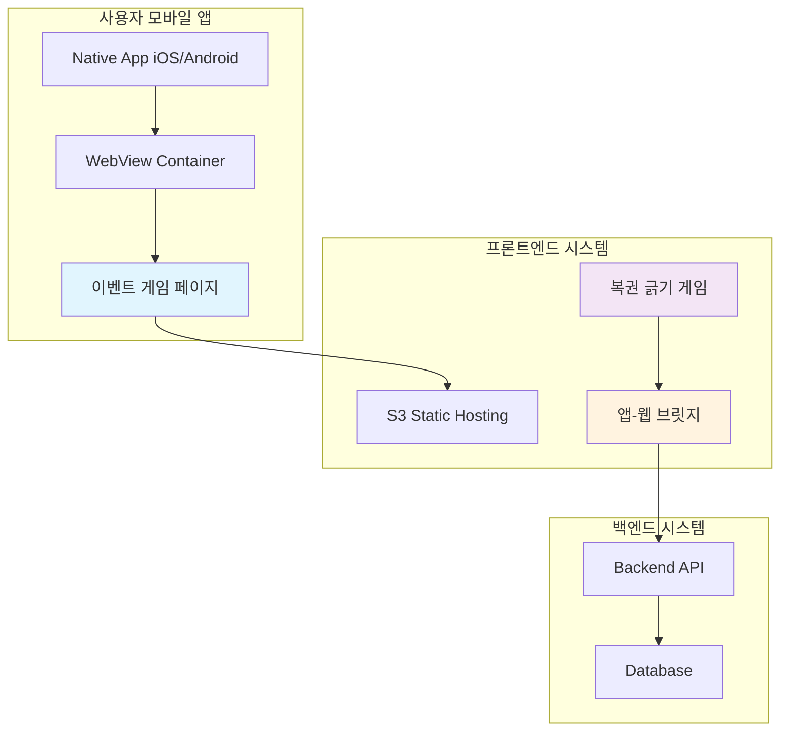
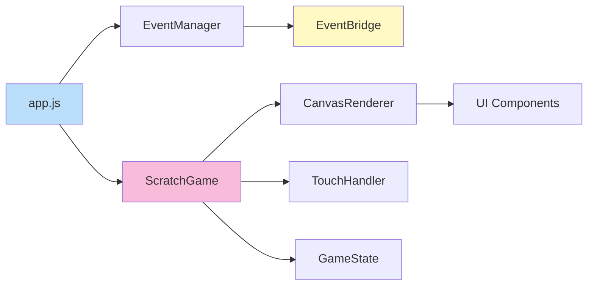
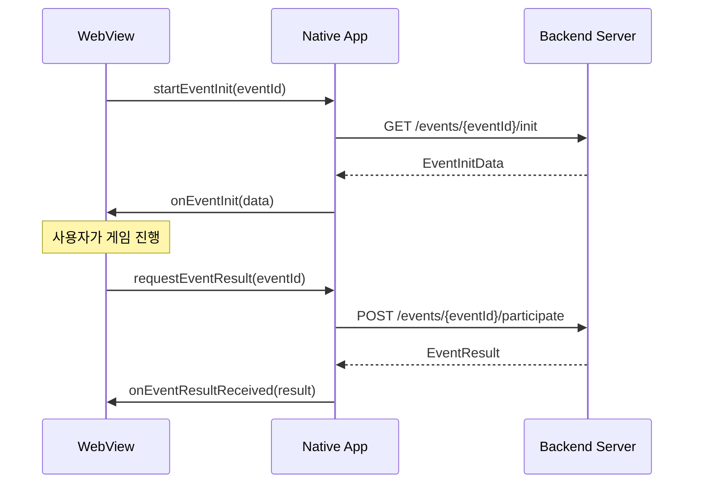
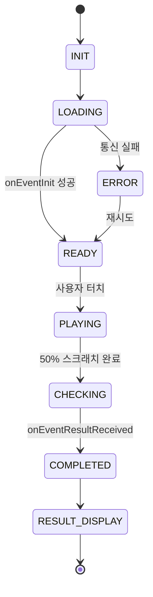
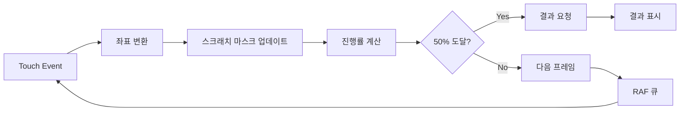
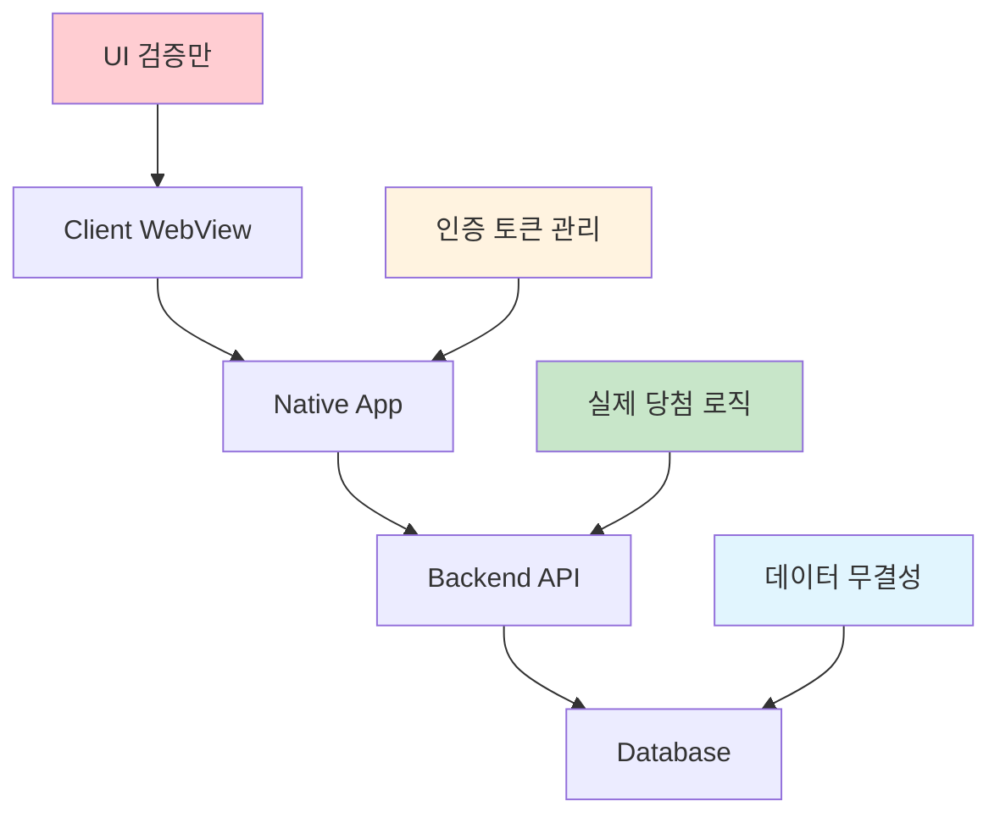
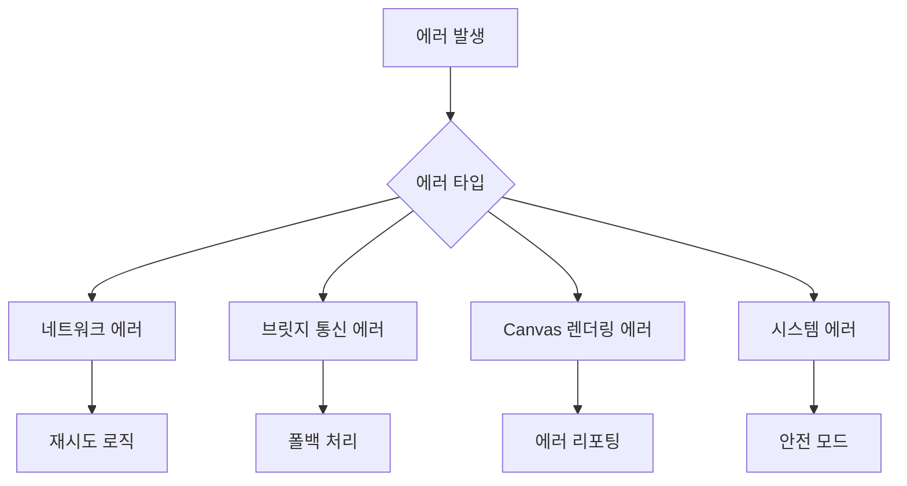

# 복권 긁기 게임 시스템 아키텍처

**프로젝트**: 마케팅 지원 룰렛 이벤트 시스템  
**담당자**: 김도현 (프론트엔드)  
**문서 버전**: v1.0  
**작성일**: 2025-09-05

---

## 📋 목차

1. [시스템 개요](#시스템-개요)
2. [전체 아키텍처](#전체-아키텍처)
3. [프론트엔드 구조](#프론트엔드-구조)
4. [앱-웹 브릿지 통신](#앱-웹-브릿지-통신)
5. [게임 상태 관리](#게임-상태-관리)
6. [Canvas 렌더링 시스템](#canvas-렌더링-시스템)
7. [성능 최적화](#성능-최적화)
8. [보안 설계](#보안-설계)
9. [에러 처리](#에러-처리)
10. [확장성 고려사항](#확장성-고려사항)

---

## 시스템 개요

### 🎯 목적
마케팅팀이 자율적으로 운영할 수 있는 사용자 참여형 복권 긁기 이벤트 시스템의 프론트엔드 구현

### 🔧 핵심 기술
- **Canvas API**: 복권 긁기 인터랙션
- **Touch Events**: 모바일 터치 최적화
- **App-Web Bridge**: 네이티브 앱 연동
- **S3 Static Hosting**: 정적 파일 배포

### 📱 지원 환경
- iOS 14+ (Safari, Chrome WebView)
- Android 5.0+ (Chrome WebView)
- 화면 크기: 5.5" ~ 6.7" 모바일

---

## 전체 아키텍처



### 시스템 플로우

1. **사용자 진입**: 앱 배너 → 네이티브 앱 WebView
2. **페이지 로드**: S3에서 정적 HTML 로드
3. **초기화**: 앱-웹 브릿지를 통한 이벤트 데이터 요청
4. **게임 진행**: Canvas 기반 복권 긁기 인터랙션
5. **결과 처리**: 앱을 통한 서버 API 호출 및 결과 표시

---

## 프론트엔드 구조

### 📁 디렉터리 구조

```
src/
├── index.html                    # 개발용 메인 HTML
├── js/
│   ├── app.js                   # 앱 진입점
│   ├── core/
│   │   ├── EventBridge.js       # 앱 통신 인터페이스
│   │   ├── EventManager.js      # 이벤트 상태 관리
│   │   └── ErrorHandler.js      # 전역 에러 처리
│   ├── game/
│   │   ├── ScratchGame.js       # 복권 게임 메인 클래스
│   │   ├── CanvasRenderer.js    # Canvas 렌더링 엔진
│   │   ├── TouchHandler.js      # 터치 이벤트 관리
│   │   └── GameState.js         # 게임 상태 관리
│   ├── ui/
│   │   ├── LoadingScreen.js     # 로딩 화면 컴포넌트
│   │   ├── ResultModal.js       # 결과 표시 모달
│   │   └── ErrorDisplay.js      # 에러 메시지 UI
│   └── utils/
│       ├── DeviceDetector.js    # 디바이스 환경 감지
│       ├── PerformanceMonitor.js # 성능 모니터링
│       └── Analytics.js         # 이벤트 분석
├── css/
│   ├── reset.css               # CSS 리셋
│   ├── layout.css              # 레이아웃 스타일
│   ├── animations.css          # 애니메이션 효과
│   └── responsive.css          # 반응형 스타일
└── assets/
    ├── images/
    │   ├── scratch-overlay.png  # 복권 오버레이 이미지
    │   └── result-bg.png       # 결과 배경 이미지
    └── icons/
        └── loading.svg         # 로딩 아이콘
```

### 🧩 핵심 모듈 관계



---

## 앱-웹 브릿지 통신

### 🌉 통신 인터페이스

```javascript
// 웹 → 앱 호출
interface WebToApp {
  startEventInit(eventId: string): void;
  requestEventResult(eventId: string): void;
  sendAnalytics(data: AnalyticsData): void;
}

// 앱 → 웹 콜백
interface AppToWeb {
  onEventInit(data: EventInitData): void;
  onEventResultReceived(result: EventResult): void;
  onEventError(error: EventError): void;
}
```

### 📡 통신 시퀀스



### 🔄 데이터 타입 정의

```typescript
interface EventInitData {
  eventId: string;
  eventName: string;
  eventType: 'scratch' | 'card';
  status: 'active' | 'inactive' | 'ended';
  participated: boolean;
  previousResult?: EventResult;
}

interface EventResult {
  success: boolean;
  isWinner: boolean;
  rewardId?: string;
  rewardName?: string;
  rewardImage?: string;
  message: string;
}

interface EventError {
  code: string;
  message: string;
  retryable: boolean;
}
```

---

## 게임 상태 관리

### 🔄 상태 전이 다이어그램



### 📋 상태별 동작

| 상태 | 설명 | 사용자 액션 | 시스템 동작 |
|------|------|------------|-------------|
| `INIT` | 앱 초기화 | - | `startEventInit()` 호출 |
| `LOADING` | 데이터 로딩 중 | - | 로딩 스피너 표시 |
| `READY` | 게임 준비 완료 | 터치 가능 | 게임 UI 활성화 |
| `PLAYING` | 게임 진행 중 | 드래그/터치 | Canvas 업데이트 |
| `CHECKING` | 결과 확인 중 | - | `requestEventResult()` 호출 |
| `COMPLETED` | 게임 완료 | - | 결과 애니메이션 |
| `RESULT_DISPLAY` | 결과 표시 | 확인 버튼 | 모달 닫기 |
| `ERROR` | 에러 상태 | 재시도 | 상태 복구 시도 |

---

## Canvas 렌더링 시스템

### 🎨 레이어 구조

```
Canvas Stack (Z-order):
┌────────────────────────────┐  z-index: 4
│     Touch Layer            │  ← 터치 이벤트 캡처
├────────────────────────────┤  z-index: 3  
│     Scratch Mask           │  ← 스크래치 효과
├────────────────────────────┤  z-index: 2
│     Result Layer           │  ← 당첨 결과 표시
├────────────────────────────┤  z-index: 1
│     Background Layer       │  ← 복권 배경
└────────────────────────────┘  z-index: 0
```

### 🖌️ 렌더링 파이프라인



### 📐 Canvas 설정

```javascript
class CanvasRenderer {
  constructor(canvas) {
    this.canvas = canvas;
    this.ctx = canvas.getContext('2d');
    this.devicePixelRatio = window.devicePixelRatio || 1;
    
    // 레티나 디스플레이 대응
    this.setupHighDPI();
  }
  
  setupHighDPI() {
    const rect = this.canvas.getBoundingClientRect();
    this.canvas.width = rect.width * this.devicePixelRatio;
    this.canvas.height = rect.height * this.devicePixelRatio;
    this.ctx.scale(this.devicePixelRatio, this.devicePixelRatio);
  }
}
```

---

## 성능 최적화

### ⚡ 최적화 전략

#### 1. 렌더링 최적화
- **RequestAnimationFrame**: 60fps 유지
- **오프스크린 캔버스**: 복잡한 계산 분리
- **GPU 가속**: `will-change: transform` 적용

#### 2. 메모리 관리
- **Canvas 크기 제한**: 최대 1080x1920
- **이벤트 리스너 정리**: 페이지 언로드 시
- **이미지 리소스 재사용**: 캐싱 적용

#### 3. 네트워크 최적화
- **단일 번들**: HTML + CSS + JS 통합
- **Gzip 압축**: 70% 크기 감소
- **이미지 최적화**: WebP 포맷 우선

### 📊 성능 목표

| 메트릭 | 목표값 | 측정 방법 |
|--------|--------|-----------|
| 페이지 로드 | < 3초 | Performance API |
| 터치 응답성 | < 100ms | Touch Event 타이밍 |
| 메모리 사용량 | < 50MB | Chrome DevTools |
| 프레임 레이트 | 60fps | RAF 콜백 간격 |

---

## 보안 설계

### 🛡️ 보안 계층



### 🔐 보안 원칙

1. **클라이언트 최소 신뢰**
   - 당첨 로직은 서버에서만 실행
   - 프론트엔드는 UI 렌더링만 담당

2. **통신 보안**
   - 앱-웹 브릿지를 통한 간접 통신
   - 직접적인 API 호출 금지

3. **조작 방지**
   - 클라이언트 사이드 검증 없음
   - 서버 사이드 중복 참여 검증

---

## 에러 처리

### 🚨 에러 분류



### 📋 에러 처리 매트릭스

| 에러 타입 | 사용자 메시지 | 복구 액션 | 로그 레벨 |
|-----------|---------------|-----------|-----------|
| 네트워크 타임아웃 | "잠시 후 다시 시도해주세요" | 자동 재시도 3회 | WARN |
| 브릿지 통신 실패 | "앱을 다시 실행해주세요" | 페이지 새로고침 | ERROR |
| 이미 참여한 이벤트 | "이미 참여하신 이벤트입니다" | 결과 화면으로 이동 | INFO |
| 시스템 오류 | "시스템 점검 중입니다" | 고객센터 안내 | FATAL |

### 🔄 에러 복구 전략

```javascript
class ErrorHandler {
  static handle(error) {
    switch(error.type) {
      case 'NETWORK_ERROR':
        return this.handleNetworkError(error);
      case 'BRIDGE_ERROR':
        return this.handleBridgeError(error);
      case 'CANVAS_ERROR':
        return this.handleCanvasError(error);
      default:
        return this.handleUnknownError(error);
    }
  }
  
  static async handleNetworkError(error) {
    const maxRetries = 3;
    for(let i = 0; i < maxRetries; i++) {
      await this.delay(1000 * (i + 1));
      try {
        return await this.retry();
      } catch(retryError) {
        if(i === maxRetries - 1) throw retryError;
      }
    }
  }
}
```

---

## 확장성 고려사항

### 🔧 확장 가능한 모듈 설계

```javascript
// 게임 타입 확장 구조
abstract class BaseGame {
  constructor(canvas, config) {}
  abstract init(): void;
  abstract start(): void;
  abstract handleInput(x: number, y: number): void;
  abstract checkProgress(): number;
  abstract complete(): void;
}

class ScratchGame extends BaseGame {
  // 복권 긁기 구현
}

class CardFlipGame extends BaseGame {
  // 향후 카드 뒤집기 게임
}

class RouletteGame extends BaseGame {
  // 향후 룰렛 게임
}
```

### 🎯 확장 로드맵

#### Phase 2 (3개월 후)
- [ ] 카드 선택 게임 추가
- [ ] 애니메이션 효과 고도화
- [ ] A/B 테스트 기능

#### Phase 3 (6개월 후)  
- [ ] 룰렛 게임 추가
- [ ] 실시간 통계 연동
- [ ] 개인화 추천 시스템

#### Phase 4 (12개월 후)
- [ ] AR/VR 게임 요소
- [ ] 소셜 공유 기능
- [ ] AI 기반 난이도 조절

### 📈 확장성 메트릭스

| 영역 | 현재 지원 | 확장 목표 |
|------|-----------|-----------|
| 게임 타입 | 1개 (스크래치) | 5개+ |
| 동시 사용자 | 1,000명 | 10,000명+ |
| 이벤트 수 | 월 2-3개 | 월 10개+ |
| 응답 시간 | < 3초 | < 1초 |

---

## 📚 관련 문서

- [프론트엔드 구현 가이드](../frontend/implementation-guide.md)
- [앱-웹 브릿지 API 명세](../api/bridge-interface.md)
- [S3 배포 가이드](../deployment/s3-deployment-guide.md)
- [테스트 전략](../testing/test-strategy.md)

---

## 📞 문의 및 지원

- **개발 담당**: 김도현
- **프로젝트 매니저**: 지예인
- **기술 리드**: 정보근
- **Jira 티켓**: [PROD-19278](https://vendysdev.atlassian.net/browse/PROD-19278)

---

**문서 히스토리**

| 버전 | 날짜 | 변경사항 | 작성자 |
|------|------|----------|--------|
| v1.0 | 2025-09-05 | 초기 아키텍처 설계 | 김도현 |